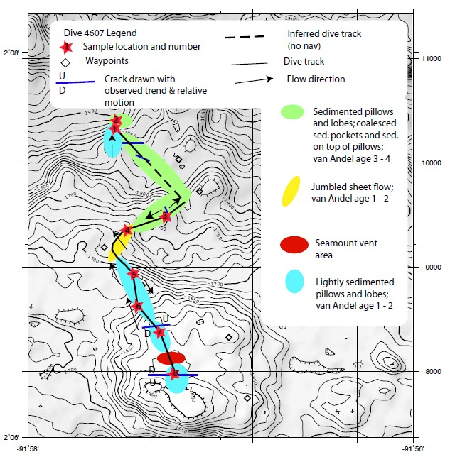

# Introduction
 Seamounts are oceanic volcanoes that form at nearly all seafloor tectonic settings. As oceanic plates are pulled apart, fissures form and eruptions of basaltic melt derived from decompression melting of the mantle occur. Over the course of hours to days, magmatic eruptions are focused in the center of the fissure because the thinner ends cool more rapidly. As the lava from this focused erutpion cools it builds the flanks of the seamount. Mass-wasting events are recorded in the morphology of seamounts as amphitheater shaped head scarps, talus, and erosive channels. Very few seamounts have been observed during construction, largely due to their remote location at the seafloor and difficulty detecting an erupting seamount from the surface. For these reasons much of their construction and deconstruction is based on scientific assumptions.  
  
  The Galapagos Spreading Center is a uniquely complex setting where the Nazca and Cocos plates meet within 100km of the Galapagos Hotspot. This study will look at the seamount Emapanada(2º6’N 92ºW) which is located on the Galapagos Spreading Center, off the coast of Ecuador. I hypothesis that Empanada experienced mass-wasting concurrent to its construction rather than exclusively after it. To test this hypothesis, I will model the emplacement of each seamount based on its observed and mapped lava morphologies, and changes in flank slope. The assessment will include maps of each seamount’s morphology based on previously collected dive video/pictures.

# Materials and methods
1. load requied packages (you may need to install some of them)
```{r, message=F, echo=T, cache=T}
library(plotly) #3d plot
library(raster) # package for raster manipulation
library(rgdal) # package for geospatial analysis
library(ggplot2) # package for plotting
library(data.table)
library(readxl) #read excel file
library(sf)
library(rasterVis)
```

2. open the raster file and assign it to an object, but wait! These z values are actually depths(distance below sea level) not elevation (distance above sea level) so we need to multiple the z values by -1 to plot accurately.

```{r, echo=T, cache=TRUE}
sm <- raster("data/empanada_clip.tif")*(-1)
```

3. Empanada is in UTM Zone 15N so we will assign it the proper projection

```{r, echo=T, cache=TRUE}
proj="+proj=utm +zone=15 +ellps=GRS80 +datum=NAD83 +units=m +no_defs"
projection(sm)=proj
```

4. Lets take a quick look at empanada

```{r, echo=F, cache=T}
emp1 <- gplot(sm) +
  geom_tile(aes(fill=value))+
  scale_fill_viridis_c()
emp1
```

5. Let's take a fancy look at Empanada
```{r, echo= F, cache=T}
sm_matrix <- as.matrix(sm)
plot_ly(z= ~sm_matrix, x=xFromCol(sm), y=yFromRow(sm)) %>% 
  add_surface() %>%
  layout(scene= list(aspectmode='manual',
                     aspectratio = list(x=1, y=1, z=0.25)))
```
Super cool, but a bit too fancy for this programmer so we'll work with the 2D map and refer back to the 3D

The GRUVEE team that collected the sentry data also took a submarine over Empanada and recorded their observations. These observaitons are available for download on their website: http://www.soest.hawaii.edu/gruvee/sci/Alvin_Dives/gruvee-divereports.html 

  
  6a. convert csv  
  6b. omit blanks   
  6c. convert to sf  
  6d. set the crs to match the sentry data  

```{r, echo=TRUE, cache=TRUE}
dive_4607 <- read.csv("data/sm_track.csv")
dive_4607_sf <- read.csv("data/sm_track.csv")%>%
  na.omit() %>%
  st_as_sf(coords=c("Easting", "Northing")) %>%
  st_set_crs(proj)
```

7. Add the dive track to the 2D map
```{r, echo=T, cache=T}
dive_track <- geom_sf(data=dive_4607_sf, inherit.aes = F,col="red", size=0.5)
emp2 <- emp1 + dive_track
```

8. Let's take another look
```{r, echo=T, cache=T}
emp2
```

9. The GRUVEE team only recorded observations at these points but we are interested in the entire seamount. Mass-wasting produces talus (broken up rocks) so let's look at the rough areas of Empanada
```{r, echo=T, cache=T}
sm_rough=terrain(sm,opt="roughness")
emp3 <- gplot(sm_rough,maxpixels=1e5) +
  geom_tile(aes(fill=value))+
  scale_fill_viridis_c()
emp3
```

10. Mass-wasting scarps are steep aphitheatre shaped cliffs so let's look at the slopes on Empanada.
```{r, echo=T, cache=T}
sm_slope=terrain(sm,opt="slope",unit="degrees")
emp5 <- gplot(sm_slope,maxpixels=1e5) +
  geom_tile(aes(fill=value))+
  scale_fill_viridis_c() 
emp5
```

11. Nice, but let's focus on just the more extreme slopes to remove the edges of the lava flows and leave us with breaks.

```{r, echo=T, cache=T}
sm_slope=terrain(sm,opt="slope",unit="degrees")
emp6 <- gplot(sm_slope>40,maxpixels=1e5) +
  geom_tile(aes(fill=value))+
  scale_fill_viridis_c()
emp6
```

12. the next step is to compare what the program has picked out to the observations the researchers made. Let's start by plotting their dive track

```{r, echo=T, cache=T}
emp6 + dive_track
```
# Results

Show tables, plots, etc. and describe them.


# Conclusions


# References
http://www.soest.hawaii.edu/gruvee/
http://www.marine-geo.org/tools/search/Files.php?data_set_uid=9464